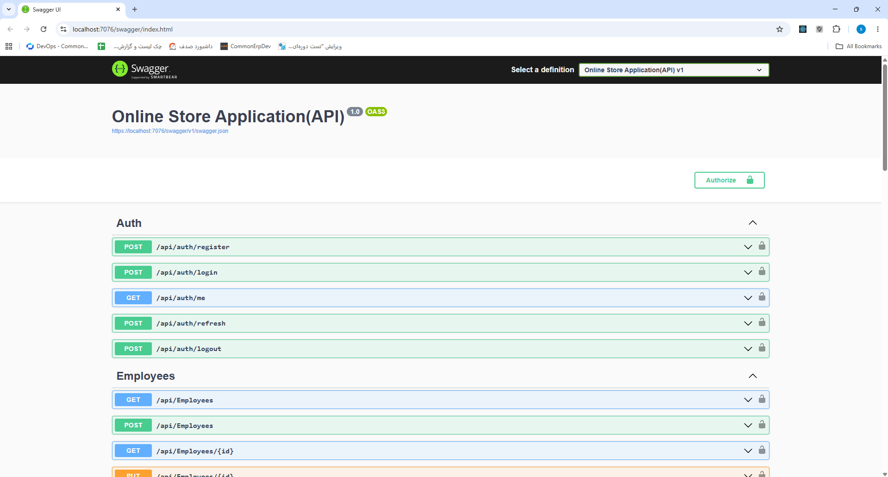

# 🛒 Online Store API

[](https://dotnet.microsoft.com/)
[](https://docs.microsoft.com/ef/core/)
[](https://swagger.io/)
[](LICENSE)
[](https://github.com/Sasan-Boddouhi/OnlineStoreApi/actions/workflows/dotnet.yml)

A production-style e-commerce REST API built with **ASP.NET Core 8**, **Clean Architecture**, and the **Specification Pattern**, showcasing advanced querying, authentication, testing, and maintainable enterprise application design.

The project demonstrates modern backend engineering practices including authentication, authorization, validation, structured logging, caching, testing, and a reusable dynamic query pipeline.

---

# 📸 Swagger UI



---

# ✨ Features

## Architecture

* Clean Architecture
* Layered Separation of Concerns
* Dependency Inversion
* Repository Pattern
* Unit of Work Pattern
* Specification Pattern

## Querying

* Dynamic Query Pipeline
* Type-safe Fluent Query DSL
* Advanced Filtering
* Sorting
* Pagination
* Projection-first Querying

## Security

* JWT Authentication
* Refresh Token Rotation (with reuse detection & automatic family revocation)
* BCrypt Password Hashing
* Session Management (device fingerprint, IP, user agent)
* Active Session Limiting (max 5 per user; oldest revoked)
* Rate Limiting (login & refresh)
* Login Lockout Protection
* SecurityStamp Validation (instant invalidation of all tokens on password change or full logout)
* Global Exception Handling (standardized ProblemDetails responses)
* Input Validation (FluentValidation)

## Performance

* Projection-first Queries
* AsNoTracking Read Operations
* Memory Caching
* Query Normalization
* Deferred IQueryable Execution
* Reusable Specifications
* N+1 Query Prevention

## Observability

* Structured Logging with Serilog
* Query Metrics Middleware
* Request Monitoring

## Developer Experience

* Swagger / OpenAPI (configurable per environment)
* FluentValidation
* AutoMapper
* Full Async Support
* CancellationToken Support
* Comprehensive Testing Infrastructure
* Docker Containerization (docker compose up)

---

# 📊 Key Highlights

* Clean Architecture implementation
* Dynamic Query DSL
* Specification Pattern
* JWT Authentication
* Refresh Token Rotation
* Rate Limiting
* Dockerized with Docker Compose
* Comprehensive Testing (330+ tests)
* GitHub Actions CI
* Structured Logging
* SQLite-backed Integration Testing
* Reusable Query Infrastructure

---

# 🏗️ Architecture

```text
┌─────────────────────────────┐
│        Presentation         │
│ Controllers, Middleware     │
└──────────────┬──────────────┘
               │
               ▼
┌─────────────────────────────┐
│       BusinessLogic         │
│ Services, DTOs, Validators  │
└──────────────┬──────────────┘
               │
               ▼
┌─────────────────────────────┐
│        Application          │
│ Entities, Contracts, Specs  │
└──────────────┬──────────────┘
               │
               ▼
┌─────────────────────────────┐
│         DataLayer           │
│ EF Core, Repositories       │
└─────────────────────────────┘
```

### Dependency Flow

```text
Presentation
     ↓
BusinessLogic
     ↓
Application
     ↓
DataLayer
```

All dependencies flow inward to preserve separation of concerns, maintainability, and testability.

---

# 🔄 Unified Query Pipeline

```text
Fluent DSL / Query String
            │
            ▼
     StringQueryParser
            │
            ▼
      QueryContract<T>
            │
            ▼
         QueryPolicy
            │
            ▼
          ToSpec()
            │
            ▼
           Spec<T>
            │
            ▼
      Repository / EF Core
```

The query pipeline converts query-string expressions into strongly typed specifications, enabling reusable filtering, sorting, paging, and projection while keeping controllers and services free from query logic.

---

# 📖 Query Examples

## Filtering

```http
GET /api/products?filter=price gt 1000
```

## Sorting

```http
GET /api/products?sort=-price,name
```

## Pagination

```http
GET /api/products?page=1&size=10
```

## Combined Query

```http
GET /api/products?filter=price gt 1000 and category.name eq 'electronics'&sort=-price&page=2&size=10
```

---

# 📂 Project Structure

```text
src/
├── Application
│   ├── Entities
│   ├── Contracts
│   └── Specifications
│
├── BusinessLogic
│   ├── Services
│   ├── DTOs
│   ├── Validators
│   └── Mappings
│
├── DataLayer
│   ├── Context
│   ├── Repositories
│   └── Persistence
│
└── OnlineStore.API
    ├── Controllers
    ├── Middleware
    └── Configuration

tests/
├── OnlineStore.Tests.Unit
├── OnlineStore.Tests.Integration
└── OnlineStore.Tests.Shared
```

---

# 🧪 Testing

The solution includes a comprehensive automated testing infrastructure.

| Project                       | Purpose                       |
| ----------------------------- | ----------------------------- |
| OnlineStore.Tests.Unit        | Fast isolated unit tests      |
| OnlineStore.Tests.Integration | End-to-end integration tests  |
| OnlineStore.Tests.Shared      | Shared fixtures and utilities |

### Testing Highlights

* 330+ automated tests (114 integration + 216 unit)
* GitHub Actions CI validation
* WebApplicationFactory integration suite
* SQLite In-Memory testing
* Coverage reporting via ReportGenerator

For detailed testing architecture and coverage workflow see:

[TESTING.md](TESTING.md)

---

# 🔄 Continuous Integration

GitHub Actions automatically:

* Restore dependencies
* Build the solution
* Execute all tests
* Generate coverage artifacts
* Fail the pipeline on test failures

Every pull request is validated before merging.

---

# ⚡ Performance Considerations

The application includes several performance optimizations:

* Projection-first querying
* AsNoTracking read operations
* Query normalization
* Memory caching
* Deferred execution
* Reusable specifications
* Efficient LINQ translation
* Prevention of N+1 database queries

---

# 🔒 Security

- **JWT Bearer Authentication** with short-lived access tokens
- **Refresh Token Rotation** with family tracking, reuse detection, and automatic revocation of all sessions in case of theft
- **Session Management** – per-device sessions with device fingerprint, IP, and user agent
- **Active Session Limiting** – maximum 5 concurrent sessions per user; oldest sessions are revoked when exceeded
- **Rate Limiting** – login: 5 req/min, refresh: 20 req/min (to prevent brute-force & abuse)
- **BCrypt Password Hashing** for secure credential storage
- **Login Lockout Protection** – account temporarily locks after 5 failed attempts
- **SecurityStamp Validation** – every JWT is verified against the current user's stamp; changing password or logging out all invalidates all tokens
- **Global Exception Handling** – all errors return standardized `ProblemDetails` (RFC 7807)
- **Input Validation** – FluentValidation auto-validation integrated across the application

---

# 📡 Error Response Format

All errors are returned as `application/problem+json` following [RFC 7807](https://tools.ietf.org/html/rfc7807).

**Example – Validation Error (422):**

```json
{
  "type": "https://tools.ietf.org/html/rfc9110#section-15.5.21",
  "title": "Validation Error",
  "status": 422,
  "errors": {
    "PhoneNumber": ["شماره موبایل معتبر نیست"],
    "Password": ["رمز عبور باید حداقل 6 کاراکتر باشد"]
  }
}
```

**Example – Business Logic Error (400):**

```json
{
  "title": "خطای کسب و کار",
  "status": 400,
  "detail": "شماره تماس تکراری است."
}
```

**Example – Internal Server Error (500):**

```json
{
  "title": "خطای سرور",
  "status": 500,
  "detail": "خطایی رخ داده است."
}
```

---

# 🛠️ Technology Stack

## Platform

* .NET 8
* ASP.NET Core Web API
* Entity Framework Core 8
* SQL Server

## Architecture

* Clean Architecture
* Repository Pattern
* Unit of Work Pattern
* Specification Pattern

## Security

* JWT Bearer Authentication
* Refresh Token Rotation
* BCrypt Password Hashing

## Validation & Mapping

* FluentValidation
* AutoMapper

## Observability

* Serilog

## Testing

* xUnit
* Moq
* FluentAssertions
* WebApplicationFactory
* SQLite In-Memory
* ReportGenerator

## Containerization

* Docker
* Docker Compose

## Documentation

* Swagger / OpenAPI

---

# 🚀 Getting Started

## Prerequisites

* .NET 8 SDK
* SQL Server (or Docker for containerized setup)

## Option 1 – Run with Docker (recommended)

```bash
# Clone the repository
git clone https://github.com/Sasan-Boddouhi/OnlineStoreApi.git
cd OnlineStoreApi

# Start all services (API + SQL Server)
docker compose up -d --build

# The API will be available at http://localhost:5000
# Swagger UI at http://localhost:5000/swagger
```

### Docker configuration
Connection strings and JWT settings are injected via environment variables in `docker-compose.yml`.  
To enable Swagger in Production, set `Swagger__Enabled=true`.

## Option 2 – Run locally

```bash
# Clone repository
git clone https://github.com/Sasan-Boddouhi/OnlineStoreApi.git
cd OnlineStoreApi

# Restore packages
dotnet restore

# Apply migrations
dotnet ef database update

# Run application
dotnet run
```

## Configure Database

Update `appsettings.Development.json` with your connection string:

```json
{
  "ConnectionStrings": {
    "DefaultConnection": "Data Source=YOUR_SERVER;Initial Catalog=ShopDB;User ID=sa;Password=YourPassword;TrustServerCertificate=True;"
  }
}
```

---

# 📚 API Documentation

After starting the application:

```text
http://localhost:5000/swagger   (Docker)
https://localhost:7076/swagger  (Local)
```

Swagger/OpenAPI documentation is generated automatically.

---

# 🔮 Roadmap

- [x] Rate Limiting (login & refresh)
- [x] Docker Containerization
- [ ] Health Checks
- [ ] Redis Distributed Cache
- [ ] OpenTelemetry & Distributed Tracing
- [ ] API Versioning
- [ ] Background Processing
- [ ] CQRS + MediatR
- [ ] Kubernetes Deployment

---

# 🤝 Contributing

Contributions, issues, and feature requests are welcome.

1. Fork the repository
2. Create a feature branch
3. Commit your changes
4. Open a Pull Request

---

# 📄 License

This project is licensed under the MIT License.

See the LICENSE file for details.

---

# 🙏 Acknowledgements

Special thanks to the teams behind:

* ASP.NET Core
* Entity Framework Core
* AutoMapper
* FluentValidation
* Serilog
* Swagger
* Docker

---

Built with ❤️ by Sasan Boddouhi
